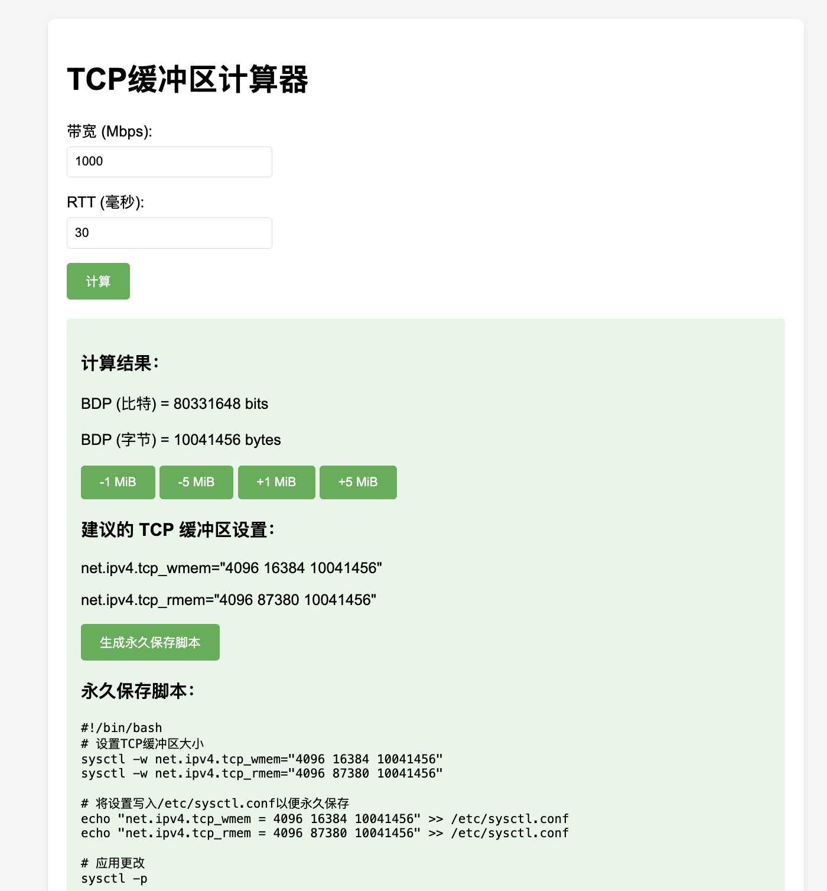

# TCP 缓冲区计算器

一个简单的网页工具，用于计算 TCP 缓冲区大小和带宽延迟积（BDP）。



> 相关文章：[TCP 调优参数计算器](https://www.nodeseek.com/post-199442-1)
> 在线使用：[TCP 调优参数计算器](https://tcp-cal.mereith.com)

## 功能特点

- 计算带宽延迟积（BDP）
- 提供推荐的 TCP 缓冲区设置
- 支持 Mbps 带宽输入
- 支持毫秒级 RTT 输入
- 提供 Docker 容器部署支持

## 快速开始

### Docker 部署

```shell
#拉取镜像
docker pull sunshinejackie/tcp-cal:latest
#运行容器
docker run -d -p 9009:80 sunshinejackie/tcp-cal:latest
```

访问 `http://localhost:9009` 即可使用计算器。

### 手动部署

直接将 `index.html` 文件部署到任何 Web 服务器即可。

## 使用方法

1. 输入带宽（单位：Mbps）
2. 输入 RTT（单位：毫秒）
3. 点击"计算"按钮
4. 查看计算结果和建议的 TCP 缓冲区设置

## 构建说明

项目包含 Docker 构建脚本，可以使用以下命令构建并推送镜像：

```bash
./build.sh
```

## PS

`tc_limit` 是另一个限流思路的调优脚本，我没仔细测试，需要的话可以试试看。

## 许可证

MIT License
